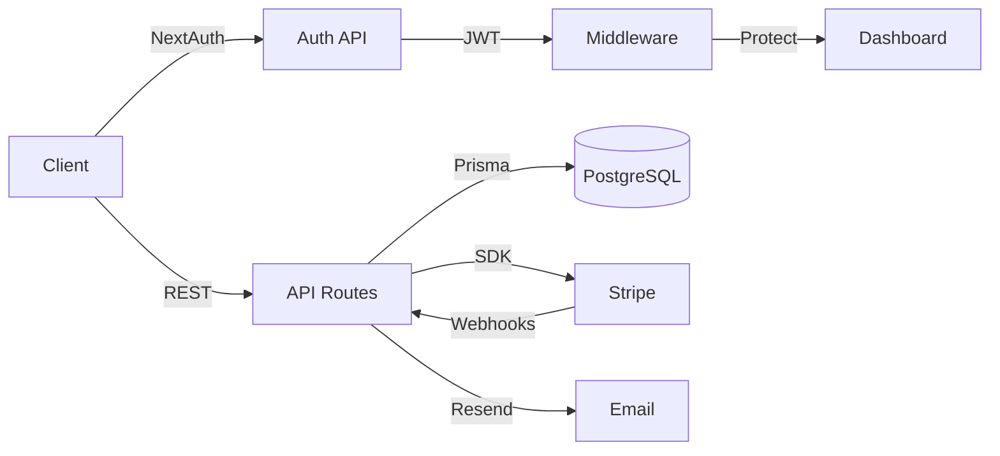
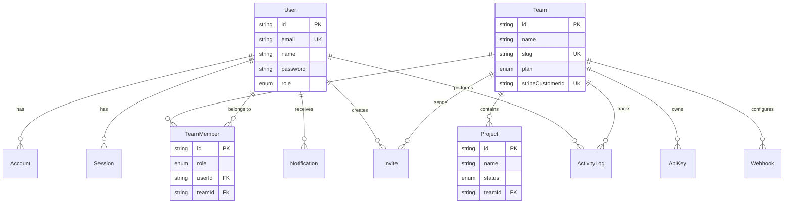

<div align="center">

# SaaS Launch Kit

### Ship your SaaS in days, not months.

A production-ready, full-stack SaaS starter kit built with **Next.js 15**, **TypeScript**, **Prisma**, **Stripe**, and **Tailwind CSS**. Everything you need to launch a modern SaaS product — authentication, billing, team management, analytics, and more.

[](LICENSE)
[](https://nextjs.org)
[](https://typescriptlang.org)
[](https://prisma.io)
[](https://stripe.com)
[](https://tailwindcss.com)

<br />

[](https://saas-launch-kit.vercel.app)

[**Getting Started**](#-getting-started) &nbsp;&middot;&nbsp; [**Features**](#-features) &nbsp;&middot;&nbsp; [**Architecture**](#-architecture) &nbsp;&middot;&nbsp; [**Tech Stack**](#-tech-stack) &nbsp;&middot;&nbsp; [**Deployment**](#-deployment) &nbsp;&middot;&nbsp; [**Contributing**](CONTRIBUTING.md)

<br />

</div>

---

## Why SaaS Launch Kit?

Building a SaaS from scratch means weeks of boilerplate — auth, billing, team management, email, API keys, webhooks. **SaaS Launch Kit** gives you all of that out of the box, so you can focus on what makes your product unique.

| Without Starter Kit | With SaaS Launch Kit |
|---|---|
| 4-6 weeks on auth alone | Auth in 5 minutes |
| Custom Stripe integration | Billing pre-configured |
| Build team management from scratch | Multi-tenant teams built-in |
| Wire up email templates | Transactional emails ready |
| Design dashboard UI | Beautiful dashboard included |
| Set up CI/CD pipeline | GitHub Actions pre-configured |

---

## Features

### Authentication & Security
- **Multi-provider auth** — Email/password, Google, GitHub via NextAuth.js v5
- **JWT sessions** — Secure, stateless authentication
- **Password hashing** — bcrypt with configurable rounds
- **Email verification** — Verify user emails on signup
- **Password reset** — Secure token-based reset flow
- **Middleware protection** — Route-level auth guards

### Billing & Subscriptions
- **Stripe integration** — Checkout, subscriptions, customer portal
- **3-tier pricing** — Free, Pro, Enterprise plans pre-configured
- **Webhook handling** — Automatic plan sync on payment events
- **Usage limits** — Per-plan limits for members, projects, API calls
- **Billing portal** — Self-service subscription management

### Team Management
- **Multi-tenant** — Users can create and join multiple teams
- **Role-based access** — Owner, Admin, Member, Viewer roles
- **Team invitations** — Email-based invite flow with expiry
- **Member management** — Add, remove, and change member roles
- **Activity logging** — Track all team actions

### Dashboard & Analytics
- **Overview dashboard** — Stats cards, revenue charts, activity feed
- **Projects table** — Sortable, filterable project list
- **Real-time stats** — Animated counters with trend indicators
- **Revenue charts** — Interactive area charts with Recharts
- **Activity feed** — Chronological action history

### Developer Experience
- **Type-safe** — End-to-end TypeScript with strict mode
- **Validation** — Zod schemas for all API inputs
- **Database** — Prisma ORM with PostgreSQL
- **Email** — Resend integration with HTML templates
- **API keys** — Generate and manage API keys per team
- **Webhooks** — Configurable webhook endpoints

### DevOps & Infrastructure
- **CI/CD** — GitHub Actions for lint, test, build
- **Docker ready** — Containerized database for development
- **Environment config** — `.env.example` with all variables documented
- **Database seeding** — One-command demo data setup

---

## Tech Stack

<table>
<tr>
<td align="center" width="140">

<br /><strong>Next.js 15</strong>
<br /><sub>App Router, RSC</sub>
</td>
<td align="center" width="140">

<br /><strong>TypeScript</strong>
<br /><sub>Strict mode</sub>
</td>
<td align="center" width="140">

<br /><strong>Prisma 6</strong>
<br /><sub>ORM + Migrations</sub>
</td>
<td align="center" width="140">

<br /><strong>PostgreSQL</strong>
<br /><sub>Database</sub>
</td>
<td align="center" width="140">

<br /><strong>Tailwind CSS</strong>
<br /><sub>Utility-first</sub>
</td>
</tr>
<tr>
<td align="center" width="140">

<br /><strong>NextAuth v5</strong>
<br /><sub>Authentication</sub>
</td>
<td align="center" width="140">

<br /><strong>React 19</strong>
<br /><sub>Server Components</sub>
</td>
<td align="center" width="140">

<br /><strong>Stripe</strong>
<br /><sub>Billing</sub>
</td>
<td align="center" width="140">

<br /><strong>GitHub Actions</strong>
<br /><sub>CI/CD</sub>
</td>
<td align="center" width="140">

<br /><strong>Docker</strong>
<br /><sub>Containers</sub>
</td>
</tr>
</table>

---

## Architecture

```
saas-launch-kit/
├── prisma/
│   ├── schema.prisma          # Database schema (Users, Teams, Billing, Projects)
│   └── seed.ts                # Demo data seeder
├── src/
│   ├── app/
│   │   ├── (auth)/            # Public auth pages
│   │   │   ├── login/         # Email + OAuth login
│   │   │   ├── signup/        # Registration with team creation
│   │   │   └── forgot-password/
│   │   ├── (dashboard)/       # Protected pages (requires auth)
│   │   │   ├── overview/      # Main dashboard with stats & charts
│   │   │   ├── analytics/     # Detailed analytics & reports
│   │   │   ├── settings/      # Account & team settings
│   │   │   ├── billing/       # Subscription management
│   │   │   └── team/          # Member management & invites
│   │   └── api/
│   │       ├── auth/          # Auth endpoints (signup, OAuth callbacks)
│   │       ├── billing/       # Stripe checkout & portal
│   │       ├── teams/         # Team CRUD & invitations
│   │       ├── users/         # User profile management
│   │       └── webhooks/      # Stripe webhook handler
│   ├── components/
│   │   ├── ui/                # Base primitives (Button, Input, Dialog...)
│   │   ├── dashboard/         # Stats cards, activity feed, tables
│   │   ├── charts/            # Revenue chart, usage graphs
│   │   ├── auth/              # Login/signup forms
│   │   └── billing/           # Pricing cards, plan comparison
│   ├── lib/
│   │   ├── auth.ts            # NextAuth config + providers
│   │   ├── db.ts              # Prisma client singleton
│   │   ├── stripe.ts          # Stripe client + plan definitions
│   │   ├── email.ts           # Resend templates (invite, welcome, reset)
│   │   └── utils.ts           # Formatters, generators, helpers
│   ├── hooks/                 # useTeam, useUser, useSubscription
│   ├── types/                 # Shared TypeScript types
│   └── middleware.ts          # Auth guard + route protection
├── .github/workflows/ci.yml   # Lint → Test → Build pipeline
├── .env.example               # All environment variables documented
└── package.json
```

### Data Flow



### Database Schema



---

## Getting Started

### Prerequisites

- **Node.js** 18+ 
- **PostgreSQL** (local or hosted)
- **Stripe** account (for billing)
- **Resend** account (for emails)

### 1. Clone & Install

```bash
git clone https://github.com/aprilnh7/saas-launch-kit.git
cd saas-launch-kit
npm install
```

### 2. Configure Environment

```bash
cp .env.example .env.local
```

Fill in your credentials:

| Variable | Where to get it |
|----------|----------------|
| `DATABASE_URL` | Your PostgreSQL connection string |
| `NEXTAUTH_SECRET` | Run `openssl rand -base64 32` |
| `GOOGLE_CLIENT_ID/SECRET` | [Google Cloud Console](https://console.cloud.google.com) |
| `GITHUB_CLIENT_ID/SECRET` | [GitHub Developer Settings](https://github.com/settings/developers) |
| `STRIPE_SECRET_KEY` | [Stripe Dashboard](https://dashboard.stripe.com/apikeys) |
| `RESEND_API_KEY` | [Resend Dashboard](https://resend.com) |

### 3. Set Up Database

```bash
npx prisma db push    # Create tables
npm run db:seed       # Load demo data
```

### 4. Start Development

```bash
npm run dev
```

Open [http://localhost:3000](http://localhost:3000) and log in with:
- **Email**: `admin@demo.com`
- **Password**: `admin123456`

### 5. Set Up Stripe (Optional)

```bash
# In a separate terminal
npm run stripe:listen
```

---

## Deployment

### Docker

```bash
docker compose up -d
```

### Manual

```bash
npm run build
npm start
```

---

## Pricing Plans

The kit comes with 3 pre-configured tiers:

| | Free | Pro | Enterprise |
|---|:---:|:---:|:---:|
| **Price** | $0 | $29/mo | $99/mo |
| Team Members | 3 | 20 | Unlimited |
| Projects | 5 | 50 | Unlimited |
| API Calls | 1,000/mo | 50,000/mo | Unlimited |
| Storage | 500MB | 10GB | Unlimited |
| Support | Community | Priority | 24/7 Dedicated |
| Analytics | Basic | Advanced | Advanced + Reports |
| SSO/SAML | - | - | Included |
| Audit Logs | - | - | Included |

---

## Roadmap

- [x] Authentication (Email, Google, GitHub)
- [x] Stripe billing & subscriptions
- [x] Team management & invitations
- [x] Dashboard with analytics
- [x] Email notifications (Resend)
- [x] API key management
- [x] Activity logging
- [x] CI/CD pipeline
- [ ] Admin panel
- [ ] Dark mode toggle
- [ ] Internationalization (i18n)
- [ ] Mobile-responsive dashboard
- [ ] Rate limiting
- [ ] File uploads (S3/R2)
- [ ] Real-time notifications (WebSocket)
- [ ] Audit log viewer

---

## Contributing

Contributions are welcome! See [CONTRIBUTING.md](CONTRIBUTING.md) for guidelines.

---

## License

This project is licensed under the [MIT License](LICENSE).

---

<div align="center">

**Built by [@aprilnh7](https://github.com/aprilnh7)**

If this helped you ship faster, consider giving it a star!

</div>
